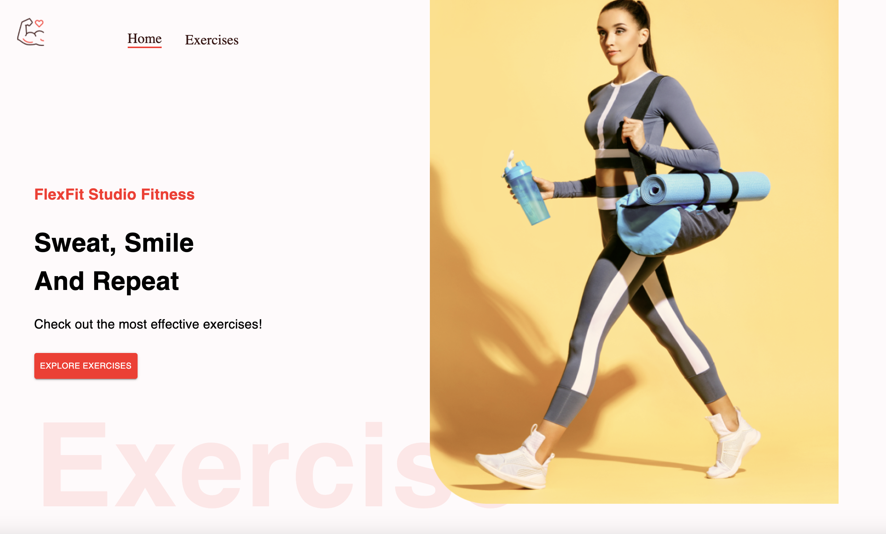
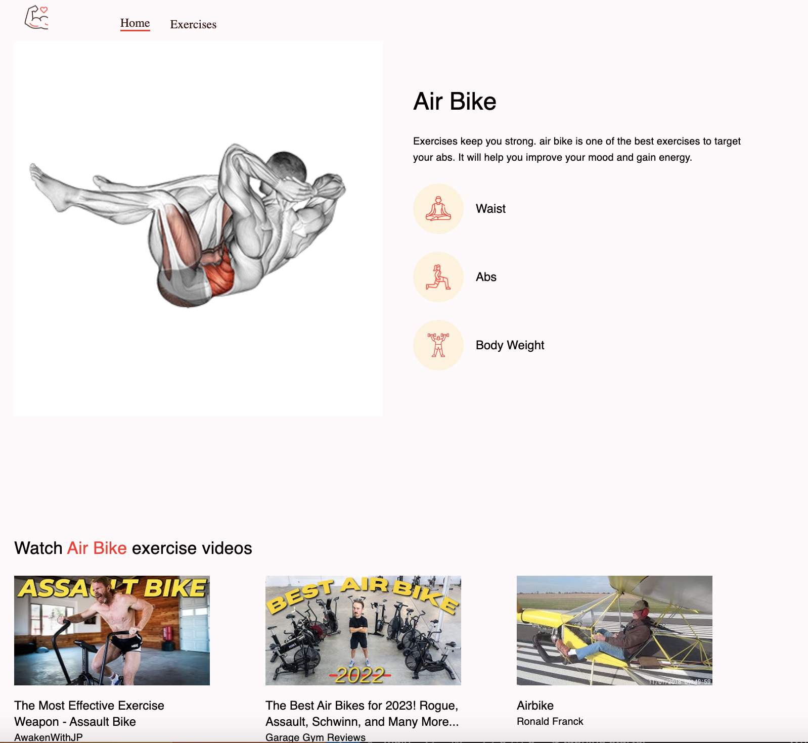

<table>
  <tr>
    <td>
      
    </td>
    <td>
      
    </td>
  </tr>
</table>

# FlexFit Studio Fitness

Are you ready to get in the best shape of your life?!
Check out this fitness app that will show you tons of effective exercises that fit your current fitness goals. Try it [here](https://flexfitstudiofitness.netlify.app/).

Usage: View a vast catalog of exercises or search by exercise, body part, or equipment to view a filtered list. Click on an exercise to see further details and video tutorials.

#

Technologies used:

<table>
      <thead>
        <tr>
          <th>Front End</th>
          <th>API</th>
          <th>Deployment</th>
        </tr>
      </thead>
      <tbody>
        <tr>
          <td>React</td>
          <td>RapidApi</td>
          <td>Netlify</td>
        </tr>
        <tr>
          <td>Material UI</td>
          <td></td>
        </tr>
        <tr>
          <td>HTML</td>
          <td></td>
          <td></td>
        </tr>
        <tr>
          <td>CSS</td>
          <td></td>
          <td></td>
        </tr>
         <tr>
          <td></td>
          <td></td>
          <td></td>
        </tr>
      </tbody>
  </table>
